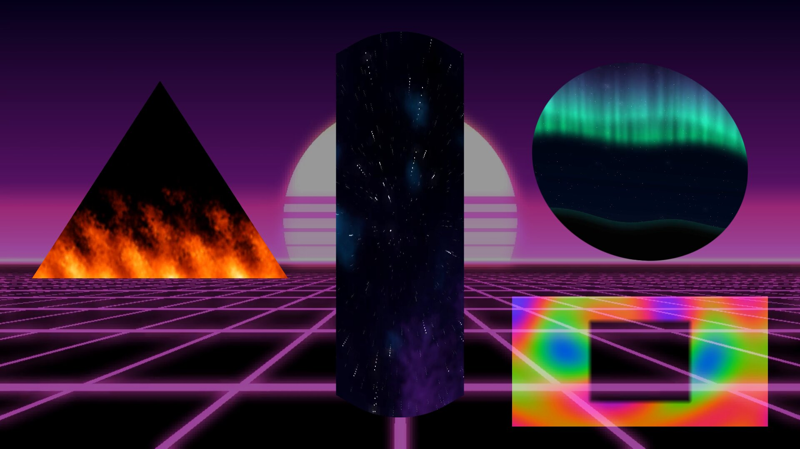
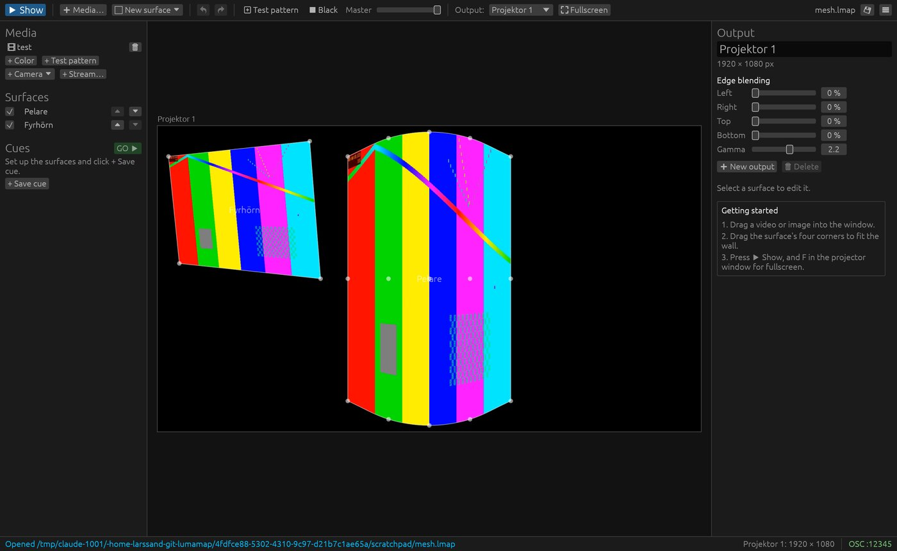

# LumaMap

Projection mapping for Linux. Put video on any surface – a wall, a pillar, a
gable – by dragging its corners until it fits. In the spirit of
[MapMap](https://mapmap.info) (simple and visual) and
[Splash](https://sat-mtl.gitlab.io/documentation/splash/) (several projectors
with edge blending).

The goal: *map a video onto a wall in two minutes without reading a manual.*



> **Status:** early development (v0.3). Usable for experiments and small
> shows, but expect rough edges. Developed on Linux Mint (Ubuntu 24.04 base).

## Features

- **What you see is what the projector shows.** The editor preview and the
  projector windows render the same image, live.
- **Surfaces:** quad (perspective-correct, no diagonal seam), triangle,
  ellipse and curved mesh (smooth spline through a grid of points).
- **Sources:** video files, images, webcams (V4L2), network streams
  (RTSP, SRT, UDP, HTTP, … via GStreamer), solid colours and a test pattern.
  Each source is decoded once, however many surfaces show it.
- **Crop** any part of the source onto a surface.
- **Masks** with soft edges – hide a window or a door, or show only inside a
  shape. Masks stay put on the wall when you adjust the surface.
- **Blend modes:** normal, add, multiply, screen.
- **Several projectors**, each in its own window, with **edge blending** where
  they overlap.
- **Cues** with fades – store which surfaces are visible, how bright and with
  which media, and step through them during a show.
- **OSC remote control** (TouchOSC, QLab, Ableton, …).
- **Undo everything**, autosave every 30 s and crash recovery.
- English and Swedish user interface.

## Install

### AppImage

Build a self-contained AppImage (GStreamer included) that runs on most
Linux distributions:

```bash
packaging/appimage/build.sh
./target/appimage/LumaMap-x86_64.AppImage
```

### From source

**1. System libraries** (Debian, Ubuntu, Linux Mint):

```bash
sudo apt install libgstreamer1.0-dev libgstreamer-plugins-base1.0-dev \
    gstreamer1.0-plugins-good gstreamer1.0-plugins-bad gstreamer1.0-libav \
    gstreamer1.0-vaapi libxkbcommon-dev libwayland-dev
```

**2. Rust** 1.95 or newer, from [rustup.rs](https://rustup.rs).

**3. Build and run:**

```bash
git clone https://github.com/dio99/lumamap.git
cd lumamap
cargo run --release
```

The binary ends up in `target/release/lumamap`.

## Getting started

1. Drag a video or image into the window. It appears on a new surface.
2. Drag the surface's four corners until they fit the wall.
3. Drag the projector window onto the projector and press **F** for fullscreen.
4. Press **▶ Show** (or **Tab**) to hide the handles.

Use **⊞ Test pattern** while aligning. Save with **Ctrl+S**; projects are
`.lmap` files with media paths relative to the project file. To move a show
to another computer, use ☰ → **Collect project…**: it copies the project and
every media file it uses into one folder.

To start a show directly, for example from autostart:

```bash
lumamap --play show.lmap
```

This opens the project in Show mode with every projector in fullscreen.

## Examples

Open `examples/showcase.lmap` to see every surface type at once: fire on a
triangle, space on a curved mesh pillar, aurora in an ellipse and a plasma
"window" with a mask and screen blending, over a neon floor. It has four cues;
press **Enter** to step through them.

`examples/gallery.lmap` shows each example video full screen, one cue per
video – press **Enter** to flip through them on your projector.

`examples/media/` contains seamless 12-second loops (1280×720) that you are
free to use in your own shows:

| Video | |
|---|---|
| `space.mp4` | Flying through a star field with coloured nebulae |
| `fire.mp4` | Flames licking upwards |
| `plasma.mp4` | Slowly flowing rainbow colours |
| `aurora.mp4` | Northern lights over mountains |
| `neon.mp4` | Synthwave grid floor under a striped sun |
| `water.mp4` | Light rippling on the bottom of a pool, with drops landing |
| `rain.mp4` | Raindrops on a window in front of blurred city lights |
| `matrix.mp4` | Falling green "Matrix" characters |
| `lightgrid.mp4` | Glowing window frames with light pulses – made for building facades |
| `galaxy.mp4` | A rotating spiral galaxy |

They are generated from code, so there are no licensing questions and you
can change them. Edit `examples/media/generate.py` and run it (needs numpy
and ffmpeg; the Matrix video also needs Pillow):

```bash
python3 examples/media/generate.py            # all videos
python3 examples/media/generate.py fire neon  # just some
```



## Keyboard

| Key | Action |
|---|---|
| Tab | Switch between Edit and Show |
| F / F11 | Fullscreen (in a projector window); Esc leaves fullscreen |
| Arrow keys | Nudge the selected corner (or whole surface) 1 px, with Shift 10 px |
| C | Select the next corner |
| Del | Delete the selected surface |
| Space | Play / pause all videos |
| Enter | Go to the next cue |
| T | Test pattern on the whole projector |
| B | Black out |
| Ctrl+Z / Ctrl+Shift+Z | Undo / redo |
| Ctrl+N / Ctrl+O / Ctrl+S / Ctrl+Shift+S | New / open / save / save as |

## OSC remote control

LumaMap listens on UDP port **12345** (change it under ☰ → OSC remote
control). Surfaces, sources and cues are addressed by name, with spaces
written as `_`, or by number.

```text
/lumamap/cue/<number or name>/go
/lumamap/cue/next
/lumamap/cue/prev
/lumamap/surface/<name>/opacity    f   (0..1)
/lumamap/surface/<name>/visible    i
/lumamap/source/<name>/play
/lumamap/source/<name>/pause
/lumamap/source/<name>/seek        f   (seconds)
/lumamap/source/<name>/speed       f   (0.1..4, 1 = normal)
/lumamap/master/opacity            f   (0 = black)
/lumamap/blackout                  i
```

Buttons that send 1 on press and 0 on release (as TouchOSC does) trigger
on the press only.

## Language

The interface follows the system language (`LANG`): Swedish if it starts
with `sv`, otherwise English. Change it under ☰ → Language / Språk; the
choice is remembered in `~/.config/lumamap/language`.

## Troubleshooting

Check a camera or stream without the editor:

```bash
cargo run -p lm-media --example probe -- cameras
cargo run -p lm-media --example probe -- camera /dev/video0
cargo run -p lm-media --example probe -- stream rtsp://camera.local/stream
```

It prints when the first frame arrives and the frame rate. More detail:
`RUST_LOG=info lumamap`.

Video is uploaded as YUV straight from the decoder and converted to RGB on
the GPU. If colours ever look wrong with a particular video, compare with
the slower CPU conversion: `LUMAMAP_VIDEO_FORMAT=rgba lumamap`.

## Development

```bash
cargo test           # model, geometry, cues, OSC and shader validation
cargo clippy --workspace --all-targets
```

The code is a Cargo workspace:

| Crate | Purpose |
|---|---|
| `lm-core` | Project model, commands, undo, cues. No GPU, no video. |
| `lm-geom` | Homography, mesh splines, hit testing. |
| `lm-media` | GStreamer sources (file, camera, stream), images, test pattern. |
| `lm-render` | wgpu rendering, shaders, edge blending. |
| `lm-control` | OSC server. |
| `lm-app` | The application: windows, egui editor. |

[ARCHITECTURE.md](ARCHITECTURE.md) (in Swedish) describes the design and the
roadmap. Next up: packaging (AppImage/Flatpak), zero-copy video, MIDI.

## License

[AGPL-3.0-or-later](LICENSE).

---

## På svenska

LumaMap är videomappning för Linux: lägg video på väggar, pelare och andra
ytor genom att dra hörnen tills de passar. Det klarar flera projektorer med
kantblandning, masker, cues med övergångar och fjärrstyrning via OSC.
Gränssnittet finns på svenska och engelska. Byt språk under ☰ → Language /
Språk. Installation och användning beskrivs ovan.
